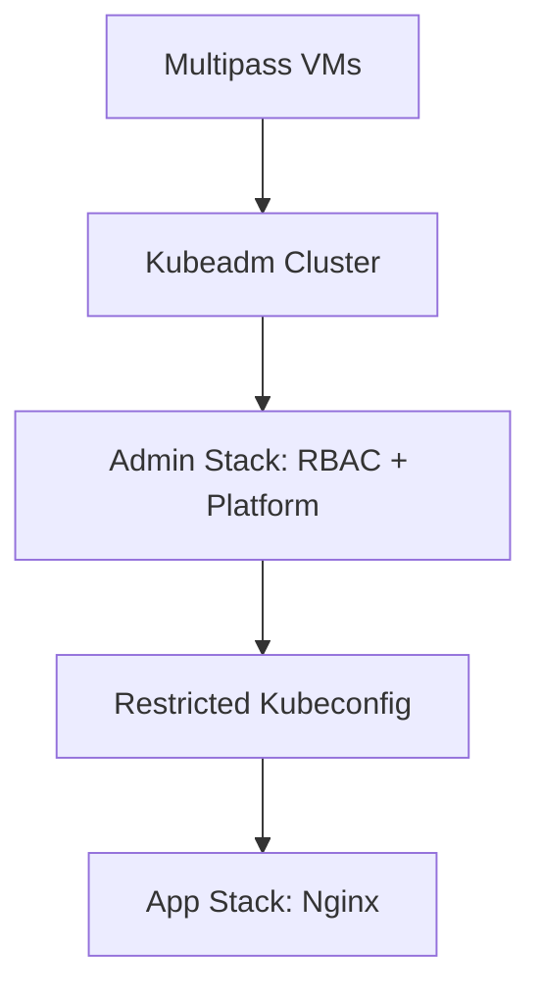

# Kubernetes Access Lab

Secure Nginx deployment on a `kubeadm` cluster using Pulumi and a restricted user.

[Design Document & Tradeoffs](docs/DESIGN.md) | [Prerequisites](#prerequisites) | [Quick Start](#quick-start) | [Teardown](#teardown)

---

## Architecture Overview

This lab demonstrates a three-layer security model, transitioning from full cluster administration to restricted application deployment.

| Layer | Component | Responsibility |
| :--- | :--- | :--- |
| **1. Infra** | `multipass` + `kubeadm` | Provisions Ubuntu VMs and bootstraps the Kubernetes control plane. |
| **2. Admin** | Pulumi (Admin Stack) | Installs platform services (CNI, Ingress, Cert-Manager) and handles RBAC/CSR bootstrapping. |
| **3. App** | Pulumi (App Stack) | Deploys the Nginx workload using a **restricted** kubeconfig with namespace-scoped permissions. |



---

## Prerequisites

Ensure you have the following installed:
- **CLI Tools:** `multipass`, `kubectl`, `pulumi`, `ngrok`
- **Language:** Go 1.21+

---

## Quick Start

### 1. Provision Cluster
Initialize the virtual machines and bootstrap the `kubeadm` cluster.

```bash
chmod +x infra/scripts/setup.sh
./infra/scripts/setup.sh

# Verify nodes are ready
export KUBECONFIG=$(pwd)/kubeconfig/admin.yaml
kubectl get nodes
```

### 2. Bootstrap Admin Layer
Deploy core platform components and generate the restricted deployer credentials.

```bash
cd infra/admin
pulumi stack init admin
pulumi config set kubeconfig ../../kubeconfig/admin.yaml
pulumi up --yes

# Extract the restricted kubeconfig for the next layer
pulumi stack output nginxDeployerKubeconfig --show-secrets > ../../kubeconfig/nginx-deployer.yaml
```

### 3. Deploy Application
Using the **restricted** credentials, deploy the Nginx application.

```bash
cd ../../apps/nginx
pulumi stack init app
pulumi config set kubeconfig ../../kubeconfig/nginx-deployer.yaml
pulumi config set host <your-host>.ngrok-free.app
pulumi config set sslRedirect false
pulumi up --yes
```

### 4. Access via ngrok
Expose the ingress controller to the internet to verify the deployment.

```bash
# Fetch connection details
IP=$(multipass info cp-1 | grep IPv4 | awk '{print $2}') && PORT=$(kubectl get svc -n ingress-nginx -l app.kubernetes.io/component=controller -o jsonpath='{.items[0].spec.ports[?(@.port==80)].nodePort}')

# Start the tunnel
ngrok http https://$IP:$PORT --host-header="<your-host>.ngrok-free.app"
```

---

## Teardown

Clean up resources in reverse order to ensure clean deletion.

```bash
# 1. Remove App Stack
cd apps/nginx && pulumi destroy --yes

# 2. Remove Admin Stack
cd ../../infra/admin && pulumi destroy --yes

# 3. Clean up VMs and Local Configs
cd ../.. && ./infra/scripts/teardown.sh
```
